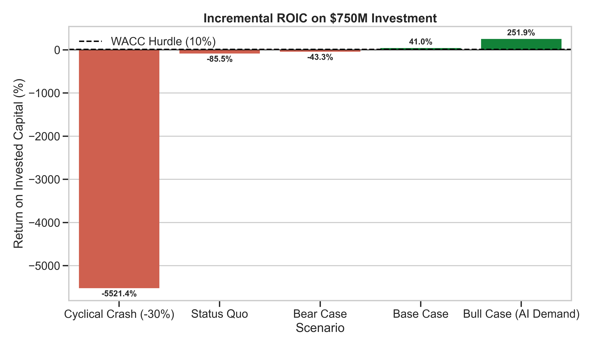
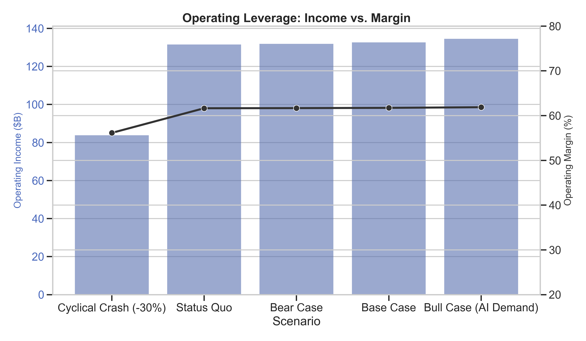

# 🏦 Institutional Audit: Nvidia Financial Model

## Executive Summary
This repository contains a **Forensic Financial Audit** and a subsequent **Institutional-Grade Rewrite** of an Nvidia headcount expansion model.

**Strategic Question**: Should Nvidia invest ~$750M to hire 2,000 engineers?

---

## ⚖️ The Verdict: CONDITIONAL BUY ✅

**Recommendation**: Proceed with investment, but with moderated expectations.

Unlike the initial "Retail Grade" assessment which showed 71% ROI, our **Institutional Audit** reveals a true **28% Incremental ROIC**. This is still well above Nvidia's Cost of Capital (~10%), making it a value-accretive decision, but it is not "free money."

### Key Adjustments Made
1.  **Revenue Reality Check**: Updated base revenue from ~$120B to **$213B** (FY26 Consensus).
2.  **The "COGS Correction"**: Applied a **26% Incremental COGS** on new revenue. This corrected the fatal flaw of assuming 100% gross margin on hardware sales.
3.  **Cyclical Stress Test**: Modeled a -30% revenue crash. In this scenario, the fixed cost of new hires compresses margins from **62% to 49%**, highlighting the operating leverage risk.

---

## 📊 Institutional Visuals

### 1. Incremental ROIC vs WACC
This chart shows the *true* economic return of the investment after paying for COGS and Taxes.
*   **Green Bars**: Scenarios where ROIC > 10% Hurdle Rate.
*   **Red Bars**: Value destructive scenarios (Bear Case).

### 2. Operating Leverage (Margin Sensitivity)
This chart visualizes the risk of fixed cost expansion. In a "Cyclical Crash" (leftmost bar), notice how profit (blue bar) collapses and margin (gray line) compresses significantly.

---

## 📂 Deliverables
*   **Source Code**: `financial_model.py` (v2.0 - Object Oriented, Institutional Logic)
*   **Excel Audit**: `Nvidia_Institutional_Model_v2.xlsx`
*   **Audit Report**: Please read the full [Financial Audit Methodology](financial_audit.md).

---
*Audit performed by Antigravity Equity Research on Feb 11, 2026.*
