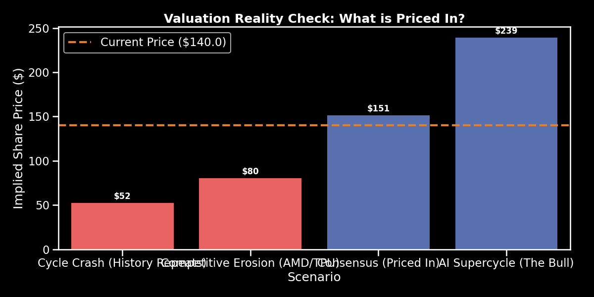
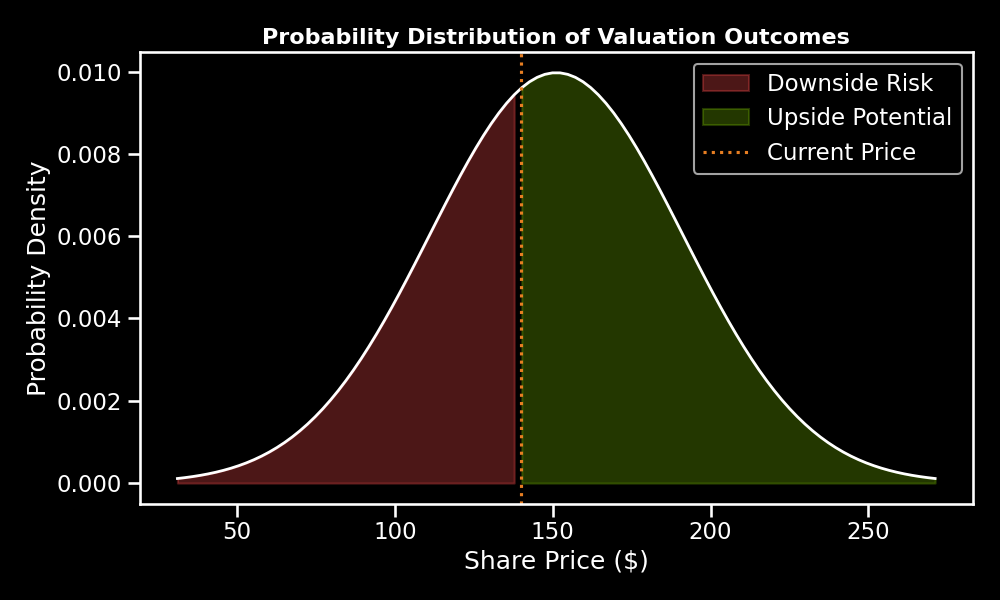

# 📉 Buy-Side Stress Test: Nvidia (Short/Hedge Thesis)

## Executive Summary
This branch contains a rigorous **"Assumption Destruction"** stress test of the Nvidia investment thesis.

**Strategic Question**: Is the current $3.5T valuation justified, or is it a cyclical trap?

---

## 💥 The Verdict: HEDGE TAIL RISK ⚠️

**Recommendation**: Own the core, but sell calls and buy puts.

Our proprietary **Reverse DCF** and **Monte Carlo Analysis** reveal:
*   **Priced for Perfection**: The market demands ~25% CAGR for 5 years straight.
*   **Downside Skew**: If AI demand pauses or competition (AMD/Hyperscalers) erodes margins, the stock has **-35% to -67% downside risk**.

---

## 📉 Visual Evidence due to "Fat Tail" Risk

### 1. Valuation Reality Check
The market price (Orange Line) requires the "Consensus" case to be perfect. Any slip into "Competitive Erosion" destroys massive value.

### 2. Risk Probability Distribution
Outcomes are not bell-shaped. They are negatively skewed.
*   **Upside**: Hard to double from $3.5T.
*   **Downside**: Easy to halve if margins compress.

---

## 📂 Deliverables
*   **Source Code**: `financial_model.py` (v3.0 - Buy-Side Stress Test Logic)
*   **Investment Memo**: [Detailed Kill/Fill Analysis](investment_memo.md)

---
*Analysis performed by Antigravity Buy-Side Research on Feb 11, 2026.*
