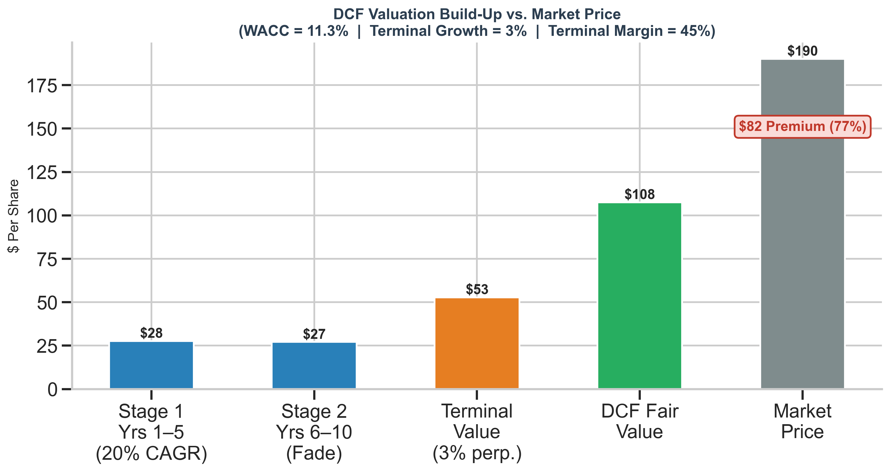
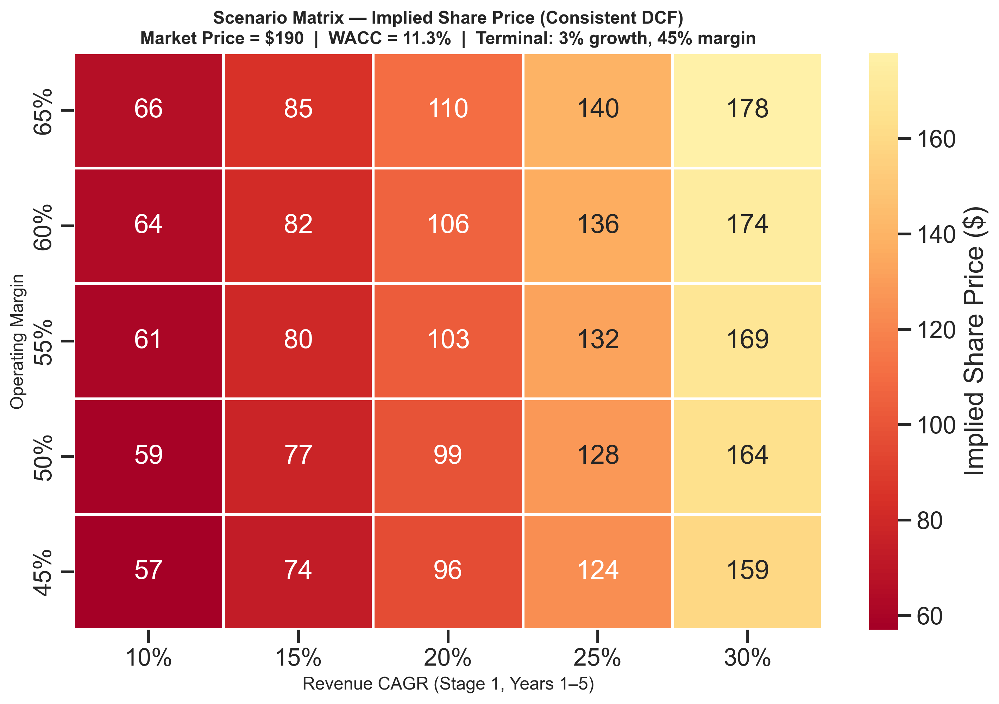

# NVIDIA Corporation — Headcount Expansion & Equity Valuation Analysis

> **Ticker:** NVDA  |  **Price:** $190.00  |  **Market Cap:** $4.67T  |  **Date:** Feb 11, 2026

---

## Objective

This model evaluates two linked strategic questions:

1. **Capital Allocation (Operating):** Should NVIDIA deploy $750M to hire 2,000 engineers?
2. **Equity Valuation (Market):** Does the current share price reflect fundamental value?

The hiring decision's value creation is explicitly linked to its impact on enterprise and equity value. All outputs use a single, consistent two-stage DCF methodology.

---

## Methodology

### Assumptions Disclosure

All assumptions are sourced and disclosed in the `Assumptions` tab of the Excel workbook.

| Parameter | Value | Source |
|-----------|-------|--------|
| Revenue (FY26E) | $213.4B | Bloomberg Consensus |
| Operating Margin | 62.0% | FY25 10-K |
| WACC | **11.3%** | CAPM (Rf = 4.3%, β = 1.50, ERP = 4.8%) |
| Terminal Growth | 3.0% | GDP + inflation proxy |
| Terminal Margin | 45.0% | Sector mean reversion |

### Valuation Framework

A **10-year, two-stage Discounted Cash Flow** is used consistently across all outputs:

- **Stage 1 (Years 1–5):** Explicit revenue growth at assumed CAGR with stated operating margin
- **Stage 2 (Years 6–10):** Linear fade of growth and margins toward terminal assumptions
- **Terminal:** Gordon Growth Model applied to Year 10 free cash flow

This single methodology is used for the base-case valuation, the scenario matrix, and the implied expectations analysis, ensuring **internal consistency**.

---

## 1. Headcount Investment: Value Accretive ✓

The incremental hiring initiative generates returns materially above the cost of capital, subject to validation of the revenue ramp and productivity assumptions.

| Metric | Value |
|--------|-------|
| Annual Investment | $750M (2,000 × $375K loaded) |
| Revenue per Engineer (Steady State) | $750K |
| Ramp Schedule | 40% → 70% → 100% (3-year) |
| Incremental CapEx | $100M (one-time, compute infra) |
| Steady-State ROIC | **37.0%** |
| WACC (Hurdle Rate) | 11.3% |
| Enterprise Value Impact (PV) | $2.8B |
| Share Price Impact | +$0.12 |

**Conclusion:** The project is value accretive. The 37% ROIC exceeds the 11.3% WACC by a significant margin. Year 1 is negative due to low ramp and upfront capex; the investment reaches positive NOPAT in Year 2 and full productivity in Year 3.

The EV impact is linked to equity value: the hiring decision adds approximately $2.8B in present value and $0.12 per share. This does not close the gap between DCF fair value and market price. The gap reflects broader market expectations beyond this specific initiative.


---

## 2. Equity Valuation: Market Price Exceeds DCF Fair Value

The current market price implies growth and margin durability that exceed the model's base-case assumptions.

| Metric | Value |
|--------|-------|
| DCF Fair Value (Base Case) | **$108** |
| Current Market Price | $190 |
| Premium to Fair Value | **77%** |
| Implied CAGR to Justify $190 | **31.7%** |
| Implied 5Y Revenue at that CAGR | $844B |

**Conclusion:** The equity is trading at a 77% premium to the base-case DCF fair value. To justify $190, the market requires ~32% revenue CAGR sustained over 5 years with no margin compression. This exceeds current consensus expectations and implies NVIDIA nearly quadrupling its revenue base within 5 years.



---

## 3. Downside Sensitivity

The scenario matrix tests implied share price across a range of growth (10–30%) and margin (45–65%) assumptions using the **same DCF methodology** as the base case.

Key observations:

- **Base case (20% CAGR, 60% margin):** ~$106 — consistent with the DCF bridge above
- **Bull case (30% CAGR, 65% margin):** $178 — still below the $190 market price
- **Bear case (10% CAGR, 45% margin):** $57 — 70% downside from current price
- **Only one cell approaches $190** at 30% growth / 65% margin — and even that falls short

The entire matrix is red/orange (below $190), indicating the market price requires assumptions beyond the range tested.



---

## Reconciliation: Hiring Decision ↔ Equity Valuation

These conclusions are not contradictory. A company can have positive-NPV internal projects while its equity is priced above intrinsic value. The hiring decision adds ~$2.8B to enterprise value ($0.12/share). This is value-creating for the firm but does not bridge the ~$82/share gap between the DCF fair value ($108) and the market price ($190). That gap reflects expectations of broad-based growth acceleration beyond the scope of this initiative.

---

## Limitations

- Revenue per engineer is estimated from aggregate efficiency ratios; actual attribution requires internal data
- WACC is sensitive to beta methodology; alternative estimates range from 10.5% to 13.0%
- Terminal margin (45%) reflects sector mean reversion but may understate NVIDIA's structural moat
- Cyclicality is modeled through margin fade in Stage 2 but not through explicit demand cycle timing
- The model does not incorporate share buybacks, dilution from SBC, or balance sheet optionality

---

## Files

| File | Description |
|------|-------------|
| `financial_model.py` | Source code — single consistent DCF methodology |
| `Nvidia_Final_Model.xlsx` | 4-tab workbook: Assumptions, Headcount ROI, DCF Valuation, Scenario Matrix |
| `visual_1_investment_decision.png` | 5-year revenue ramp + ROIC vs WACC |
| `visual_2_valuation_bridge.png` | DCF build-up vs market price |
| `visual_3_scenario_matrix.png` | Growth × Margin scenario heatmap |

---

## How to Run

```bash
pip install pandas numpy matplotlib seaborn xlsxwriter
python financial_model.py
```

---

*Antigravity Institutional Research  •  Feb 11, 2026*
