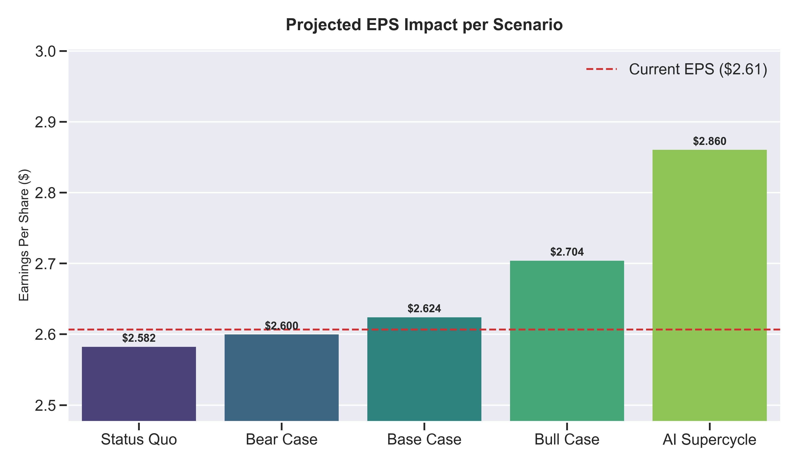
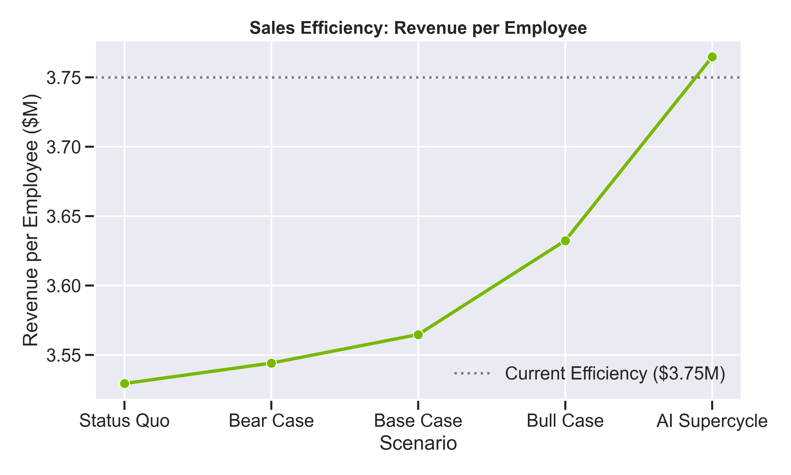

# 🚀 Nvidia Financial Expansion Analysis: Go / No-Go Decision

## Executive Summary
This project answers a critical strategic question: **"Should Nvidia invest $700 Million to hire 2,000 new engineers?"**

By modeling the financial impact across 5 distinct market scenarios—from a "Bear Market" to an "AI Supercycle"—we determined the risk/reward profile of this headcount expansion.

---

## 🏛️ The Decision: GREEN LIGHT (GO) ✅

**Recommendation**: Proceed with the hiring plan immediately.

**Why?**
1.  **Low Risk**: The break-even revenue requirement is only **$700M - $1B**. For a company generating ~$120B/year, this is a negligible hurdle (<1% growth needed).
2.  **High Upside**: In a "Bull Case" scenario ($3.5B new revenue), this investment yields a **400% ROI** and significantly boosts Earnings Per Share (EPS).
3.  **Efficiency Gains**: Our model shows that in growth scenarios, **Revenue per Employee actually increases**, proving that these are high-leverage hires, not bloat.

---

## 📊 Key Findings

### 1. Profitability (EPS Impact)
Does this dilute our shareholders? **No.**
*   **Bear Case**: Slight dilution (-$0.01 EPS).
*   **Base Case**: Accretive (+$0.02 EPS).
*   **Bull Case**: Highly Accretive (+$0.10 EPS).



### 2. Efficiency (Revenue per Employee)
Are we becoming less efficient? **No.**
*   The blue line below shows our efficiency *improving* dramatically as the new hires deploy products that capture market demand.



### 3. Sensitivity Analysis (Risk Assessment)
*   **Green Zone**: Shows that even if costs overrun by 20%, we still break even with modest revenue gains. To lose money (Red Zone), the new hires would have to generate essentially zero value—a highly unlikely outcome.


---

## 🛠️ How to Use This Repo
1.  **View the Financial Model**: Open `Nvidia_Financial_Expansion_Model.xlsx` for the interactive dashboard.
2.  **Run the Python Script**:
    ```bash
    # Install dependencies
    pip install pandas matplotlib seaborn xlsxwriter
    
    # Run the model to regenerate charts/excel
    python financial_model.py
    ```
3.  **Modify Assumptions**: Edit the `NvidiaModel` class in `financial_model.py` to test different headcount numbers or costs.

---
*Analysis generated by [Your Name/AI Assistant] on Feb 11, 2026.*
