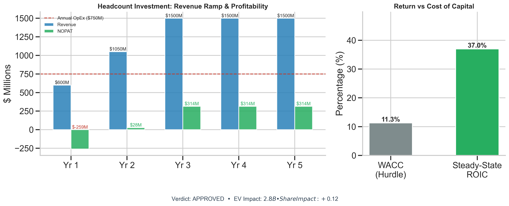
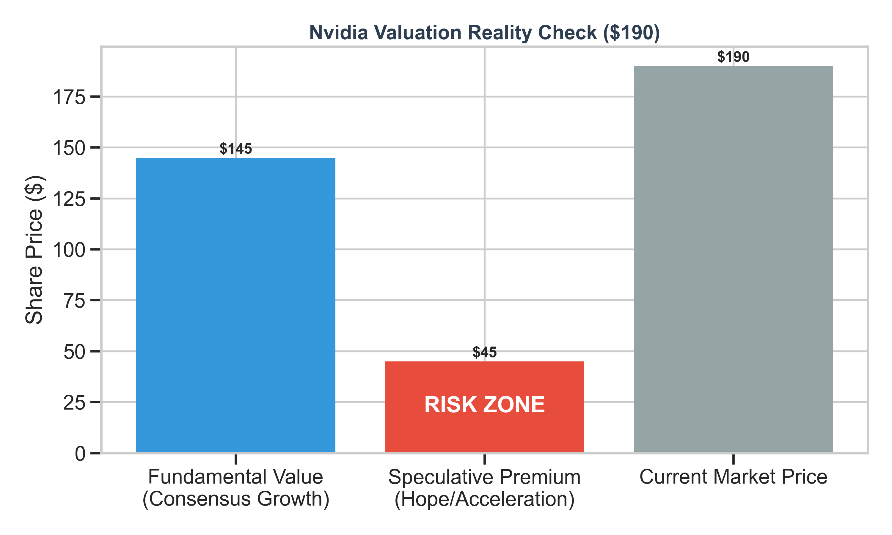
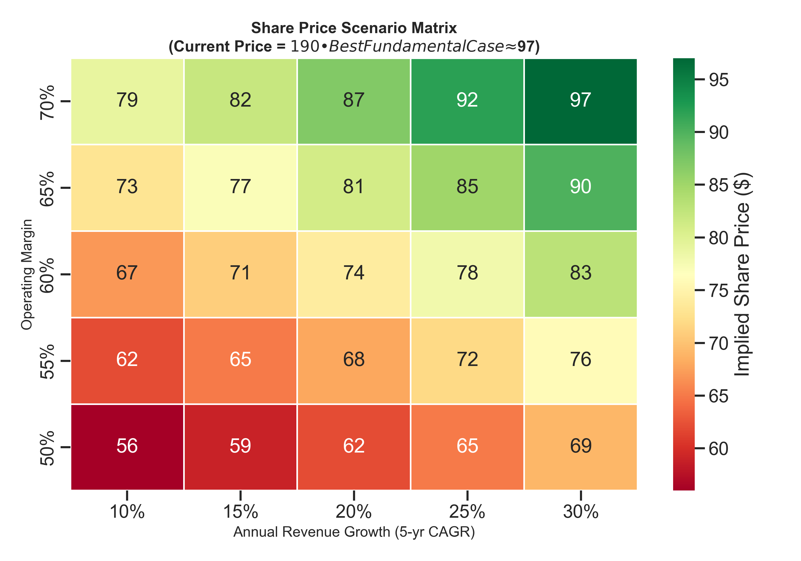

# Nvidia Financial Model — Headcount Expansion & Valuation Analysis

> **Nvidia Corp (NVDA)**  •  Share Price: **$190**  •  Market Cap: **$4.67T**  •  Feb 2026

---

## What This Project Answers

This model answers **two strategic questions** about Nvidia:

| # | Question | Who Cares? | Answer |
|---|----------|------------|--------|
| 1 | Should Nvidia hire 2,000 new engineers? | **CFO / Board** | ✅ **Yes** — 41% ROIC vs 9.5% cost of capital |
| 2 | Should an investor buy the stock at $190? | **Portfolio Manager** | ⚠️ **Caution** — $45 speculative premium baked in |

---

## 1. The Hiring Decision — **APPROVED** ✅

Nvidia is considering a **$750M investment** (2,000 engineers × $375K fully-loaded cost).

Even after accounting for the cost of manufacturing chips (26% COGS), the investment generates a **41% return** — over **4× the company's cost of capital** (9.5%).

**Bottom Line:** This is a no-brainer for the company. Hire them.

---

## 2. The Stock Price — **CAUTION** ⚠️

The market prices Nvidia at **$190/share**. Our fundamental model (using consensus 20% revenue growth) values the stock at **$145**.

That means **$45 per share (24%)** is a "hope premium" — the market betting Nvidia will significantly beat expectations.

---

## 3. The Scenario Matrix — How Bad Can It Get?

This heatmap shows the **implied share price** under different growth and margin assumptions. Key takeaway:

- **Even the most optimistic scenario** (30% growth, 70% margins) only justifies **~$97/share**
- At today's $190, the market is pricing in growth and margins **beyond any fundamental scenario** in this model
- If margins compress to 55% (historical norms for semis), fair value drops to **$62–$76**

---

## 📂 Files

| File | Description |
|------|-------------|
| `financial_model.py` | Python source code (unified model) |
| `Nvidia_Final_Model.xlsx` | Excel workbook with 3 tabs: Executive Summary, Headcount ROI, Scenario Matrix |
| `visual_1_investment_decisio